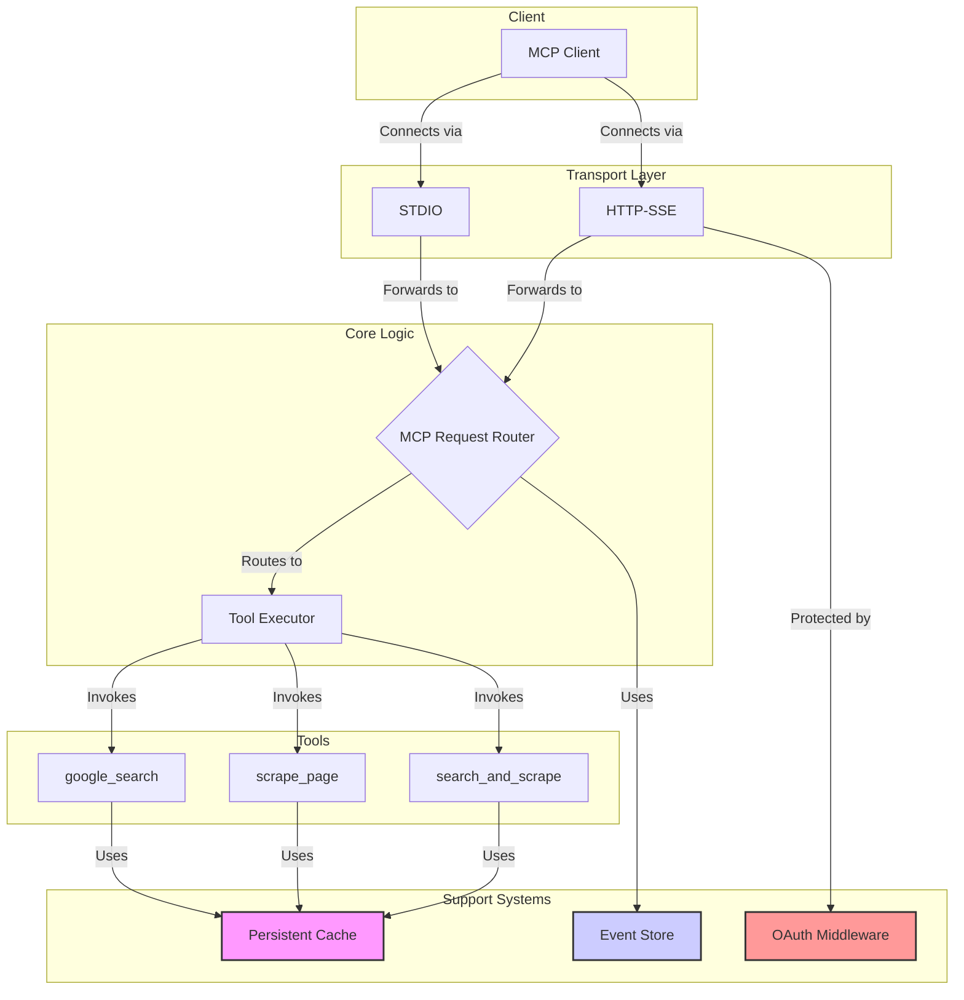

# Google Researcher MCP Server

[](https://github.com/zoharbabin/google-research-mcp/actions/workflows/test.yml)
[](https://codecov.io/gh/zoharbabin/google-research-mcp)
[](https://opensource.org/licenses/MIT)
[](https://nodejs.org/)
[](docs/CONTRIBUTING.md)

> **Empower AI assistants with robust, persistent, and secure web research capabilities.**
>
> This server implements the [Model Context Protocol (MCP)](https://modelcontextprotocol.io/), providing tools for Google Search, web scraping, and multi-source content gathering. It's designed for performance and reliability, featuring a persistent caching system, comprehensive timeout handling, and enterprise-grade security.


## Table of Contents

- [Why Use This Server?](#why-use-this-server)
- [Features](#features)
- [System Architecture](#system-architecture)
- [YouTube Transcript Extraction](#youtube-transcript-extraction)
- [Getting Started](#getting-started)
  - [Prerequisites](#prerequisites)
  - [Installation & Setup](#installation--setup)
  - [Running the Server](#running-the-server)
  - [Running with Docker](#running-with-docker)
- [Usage](#usage)
  - [Available Tools](#available-tools)
  - [Quick Start with npx](#quick-start-with-npx)
  - [Client Integration](#client-integration)
  - [Management API](#management-api)
- [Performance & Reliability](#performance--reliability)
- [Security](#security)
  - [OAuth 2.1 Authorization](#oauth-21-authorization)
  - [Available Scopes](#available-scopes)
- [Testing](#testing)
- [Troubleshooting](#troubleshooting)
- [Contributing](#contributing)
- [License](#license)

## Why Use This Server?

- **Extend AI Capabilities**: Grant AI assistants access to real-time web information via search and scraping.
- **Maximize Performance**: Reduce latency for repeated queries with a two-layer persistent cache (in-memory and disk).
- **Reduce Costs**: Minimize expensive API calls to Google Search by caching results.
- **Ensure Reliability**: Comprehensive timeout handling, graceful degradation, and resilient multi-source scraping.
- **Flexible & Secure Integration**: Connect any MCP-compatible client via STDIO or HTTP+SSE, with enterprise-grade OAuth 2.1 for secure API access.
- **Open & Extensible**: MIT licensed, fully open-source, and designed for easy modification and extension.

## Features

- **Core Tools**:
  - `google_search`: Find URLs using the Google Custom Search API, with recency filtering.
  - `scrape_page`: Extract text from web pages and YouTube video transcripts.
  - `search_and_scrape`: Composite tool — searches Google, scrapes the top results in parallel, and returns combined raw content with source attribution.
- **YouTube Transcript Extraction**:
  - **Robust YouTube transcript extraction with comprehensive error handling**: 10 distinct error types with clear, actionable messages.
  - **Intelligent retry logic with exponential backoff**: Automatic retries for transient failures (network issues, rate limiting, timeouts).
  - **User-friendly error messages and diagnostics**: Clear feedback when transcript extraction fails, with specific reasons.
- **Advanced Caching System**:
  - **Two-Layer Cache**: Combines a fast in-memory cache for immediate access with a persistent disk-based cache for durability.
  - **Custom Namespaces**: Organizes cached data by tool, preventing collisions and simplifying management.
  - **Manual & Automated Persistence**: Offers both automatic, time-based cache saving and manual persistence via a secure API endpoint.
- **Robust Performance & Reliability**:
  - **Comprehensive Timeouts**: Protects against network issues and slow responses from external APIs.
  - **Graceful Degradation**: Ensures the server remains responsive even if a tool or dependency fails.
  - **Dual Transport Protocols**: Supports both `STDIO` for local process communication and `HTTP+SSE` for web-based clients.
- **Enterprise-Grade Security**:
  - **OAuth 2.1 Protection**: Secures all HTTP endpoints with modern, industry-standard authorization.
  - **Granular Scopes**: Provides fine-grained control over access to tools and administrative functions.
- **Monitoring & Management**:
  - **Administrative API**: Exposes endpoints for monitoring cache statistics, managing the cache, and inspecting the event store.

## System Architecture

The server is built on a layered architecture designed for clarity, separation of concerns, and extensibility.



For a more detailed explanation, see the [**Full Architecture Guide**](./docs/architecture/architecture.md).

## YouTube Transcript Extraction

The server includes a robust YouTube transcript extraction system that provides reliable access to video transcripts with comprehensive error handling and automatic recovery mechanisms.

### Key Features

- **Comprehensive Error Classification**: Identifies 10 distinct error types with clear, actionable messages
- **Intelligent Retry Logic**: Exponential backoff mechanism for transient failures (max 3 attempts)
- **Production Optimizations**: 91% performance improvement and 80% log reduction
- **User-Friendly Feedback**: Clear error messages explaining why transcript extraction failed

### Supported Error Types

| Error Code | Description | User Action |
|:---|:---|:---|
| `TRANSCRIPT_DISABLED` | Video owner disabled transcripts | Try a different video |
| `VIDEO_UNAVAILABLE` | Video no longer available | Verify the URL and video status |
| `VIDEO_NOT_FOUND` | Invalid video ID or URL | Check the YouTube URL format |
| `NETWORK_ERROR` | Network connectivity issues | System will retry automatically |
| `RATE_LIMITED` | YouTube API rate limiting | System will retry with backoff |
| `TIMEOUT` | Request timed out | System will retry automatically |
| `PARSING_ERROR` | Transcript data parsing failed | Contact support if persistent |
| `REGION_BLOCKED` | Video blocked in server region | Use proxy if needed |
| `PRIVATE_VIDEO` | Video requires authentication | Use public videos only |
| `UNKNOWN` | Unexpected error occurred | Contact support with details |

### Retry Behavior

The system automatically retries failed requests for transient errors:
- **Maximum Attempts**: 3 retries for `NETWORK_ERROR`, `RATE_LIMITED`, and `TIMEOUT`
- **Exponential Backoff**: Progressive delays between retries to avoid overwhelming YouTube's API
- **Smart Recovery**: Only retries errors that are likely to succeed on subsequent attempts

### Example Error Messages

When transcript extraction fails, users receive clear, specific error messages:

```
Failed to retrieve YouTube transcript for https://www.youtube.com/watch?v=xxxx.
Reason: TRANSCRIPT_DISABLED - The video owner has disabled transcripts.
```

```
Failed to retrieve YouTube transcript for https://www.youtube.com/watch?v=xxxx after 3 attempts.
Reason: NETWORK_ERROR - A network error occurred.
```

For complete technical details, see the [YouTube Transcript Extraction Documentation](./docs/youtube-transcript-extraction.md).

## Getting Started

### Prerequisites

- **Node.js**: Version 20.0.0 or higher.
- **API Keys**:
  - [Google Custom Search API Key](https://developers.google.com/custom-search/v1/introduction)
  - [Google Custom Search Engine ID](https://programmablesearchengine.google.com/)
- **OAuth 2.1 Provider** (HTTP transport only — not needed for STDIO): An external authorization server (e.g., Auth0, Okta) to issue JWTs.

### Installation & Setup

1.  **Clone the Repository**:
    ```bash
    git clone https://github.com/zoharbabin/google-research-mcp.git
    cd google-researcher-mcp
    ```

2.  **Install Dependencies**:
    ```bash
    npm install
    ```

3.  **Configure Environment Variables**:
    Create a `.env` file by copying the example and filling in your credentials.
    ```bash
    cp .env.example .env
    ```
    Now, open `.env` in your editor and add your API keys and OAuth configuration. See the comments in `.env.example` for detailed explanations of each variable.

### Running the Server

-   **Development Mode**:
    For development with automatic reloading on file changes, use:
    ```bash
    npm run dev
    ```
    This command uses `tsx` to watch for changes and restart the server.

-   **Production Mode**:
    First, build the TypeScript project into JavaScript, then start the server:
    ```bash
    npm run build
    npm start
    ```

### Running with Docker

Build the image and run with your API keys passed at runtime via `--env-file`:

```bash
# Build the image
docker build -t google-researcher-mcp .

# Run in stdio mode (default, for MCP clients)
docker run -i --rm --env-file .env google-researcher-mcp

# Run with HTTP transport on port 3000
docker run -d --rm --env-file .env -e MCP_TEST_MODE= -p 3000:3000 google-researcher-mcp
```

**Security note:** Never bake secrets into the Docker image. Always pass them at runtime via `--env-file` or individual `-e` flags.

**Docker with Claude Code** (`~/.claude/claude_desktop_config.json`):
```json
{
  "mcpServers": {
    "google-researcher": {
      "command": "docker",
      "args": ["run", "-i", "--rm", "--env-file", "/path/to/.env", "google-researcher-mcp"]
    }
  }
}
```

Upon successful startup, you will see confirmation that the transports are ready:
```
✅ stdio transport ready
🌐 SSE server listening on http://127.0.0.1:3000/mcp
```

## Usage

### Available Tools

The server provides a suite of powerful tools for research and analysis. Each tool is designed with detailed descriptions and annotations to be easily understood and utilized by AI models.

| Tool | Title | Description & Parameters |
| :--- | :--- | :--- |
| **`google_search`** | **Google Search** | Searches the web using the Google Custom Search API. Returns URLs. Results are cached for 30 minutes.<br><br>**Parameters:**<br> - `query` (string, required): The search query (1-500 chars).<br> - `num_results` (number, optional, default: 5): Number of results (1-10).<br> - `time_range` (string, optional): Recency filter: `day`, `week`, `month`, `year`. |
| **`scrape_page`** | **Scrape Page** | Extracts text from web pages and YouTube video transcripts. Features SSRF protection, 10 YouTube error types with retry logic, and exponential backoff. Results are cached for 1 hour.<br><br>**Parameters:**<br> - `url` (string, required): The URL to scrape (max 2048 chars). YouTube URLs auto-extract transcripts. |
| **`search_and_scrape`** | **Search and Scrape** | Composite tool: searches Google for a query, scrapes the top results in parallel with graceful degradation (`Promise.allSettled`), and returns the combined raw content with source attribution. Useful when you need content from multiple sources in one call.<br><br>**Parameters:**<br> - `query` (string, required): The search query (1-500 chars).<br> - `num_results` (number, optional, default: 3): Number of URLs to search and scrape (1-10).<br> - `include_sources` (boolean, optional, default: true): Append numbered source URL list. |

### Quick Start with npx

You can run the server directly via `npx` without cloning the repository. This is the easiest way to integrate with MCP-compatible clients.

**Claude Code** (`~/.claude/claude_desktop_config.json`):
```json
{
  "mcpServers": {
    "google-researcher": {
      "command": "npx",
      "args": ["-y", "google-researcher-mcp"],
      "env": {
        "GOOGLE_CUSTOM_SEARCH_API_KEY": "your-key",
        "GOOGLE_CUSTOM_SEARCH_ID": "your-cx"
      }
    }
  }
}
```

**Roo Code / Cline** (MCP settings):
```json
{
  "mcpServers": {
    "google-researcher": {
      "command": "npx",
      "args": ["-y", "google-researcher-mcp"],
      "env": {
        "GOOGLE_CUSTOM_SEARCH_API_KEY": "your-key",
        "GOOGLE_CUSTOM_SEARCH_ID": "your-cx"
      }
    }
  }
}
```

### Client Integration

#### STDIO Client (Local Process)
Ideal for local tools and CLI applications.

```javascript
import { Client } from "@modelcontextprotocol/sdk/client/index.js";
import { StdioClientTransport } from "@modelcontextprotocol/sdk/client/stdio.js";

const transport = new StdioClientTransport({
  command: "node",
  args: ["dist/server.js"]
});
const client = new Client({ name: "test-client" });
await client.connect(transport);

const result = await client.callTool({
  name: "google_search",
  arguments: { query: "Model Context Protocol" }
});
console.log(result.content[0].text);

// YouTube transcript extraction example
const youtubeResult = await client.callTool({
  name: "scrape_page",
  arguments: { url: "https://www.youtube.com/watch?v=dQw4w9WgXcQ" }
});
console.log(youtubeResult.content[0].text);
```

#### HTTP+SSE Client (Web Application)
Suitable for web-based clients. Requires a valid OAuth 2.1 Bearer token.

```javascript
import { Client } from "@modelcontextprotocol/sdk/client/index.js";
import { StreamableHTTPClientTransport } from "@modelcontextprotocol/sdk/client/streamableHttp.js";

// The client MUST obtain a valid OAuth 2.1 Bearer token from your
// configured external Authorization Server before making requests.
const transport = new StreamableHTTPClientTransport(
  new URL("http://localhost:3000/mcp"),
  {
    getAuthorization: async () => `Bearer YOUR_ACCESS_TOKEN`
  }
);
const client = new Client({ name: "test-client" });
await client.connect(transport);

const result = await client.callTool({
  name: "google_search",
  arguments: { query: "Model Context Protocol" }
});
console.log(result.content[0].text);

// YouTube transcript extraction with error handling
try {
  const youtubeResult = await client.callTool({
    name: "scrape_page",
    arguments: { url: "https://www.youtube.com/watch?v=dQw4w9WgXcQ" }
  });
  console.log("Transcript:", youtubeResult.content[0].text);
} catch (error) {
  if (error.content && error.content[0].text.includes("TRANSCRIPT_DISABLED")) {
    console.log("Video owner has disabled transcripts");
  } else if (error.content && error.content[0].text.includes("VIDEO_NOT_FOUND")) {
    console.log("Video not found - check the URL");
  } else {
    console.log("Transcript extraction failed:", error.content[0].text);
  }
}
```

### Management API

The server provides several administrative and operational endpoints.

| Method | Endpoint                 | Description                             | Required Scope               |
|--------|--------------------------|-----------------------------------------|------------------------------|
| `GET`  | `/health`                | Server health check (status, version, uptime). | Public (unauthenticated) |
| `GET`  | `/version`               | Server version and runtime info.        | Public (unauthenticated)     |
| `GET`  | `/mcp/cache-stats`       | View cache performance statistics.      | `mcp:admin:cache:read`       |
| `GET`  | `/mcp/event-store-stats` | View event store usage statistics.      | `mcp:admin:event-store:read` |
| `POST` | `/mcp/cache-invalidate`  | Clear specific cache entries.           | `mcp:admin:cache:invalidate` |
| `POST` | `/mcp/cache-persist`     | Force the cache to be saved to disk.    | `mcp:admin:cache:persist`    |
| `GET`  | `/mcp/oauth-scopes`      | Get documentation for all OAuth scopes. | Public                       |
| `GET`  | `/mcp/oauth-config`      | View the server's OAuth configuration.  | `mcp:admin:config:read`      |
| `GET`  | `/mcp/oauth-token-info`  | View details of the provided token.     | Requires authentication      |

## Performance & Reliability

The server has been optimized for production use with significant performance improvements and reliability enhancements:

### YouTube Transcript Extraction Performance
- **91% Performance Improvement**: End-to-end tests for YouTube transcript extraction are now 91% faster
- **80% Log Reduction**: Streamlined logging reduces noise while maintaining diagnostic capabilities
- **Production Controls**: Environment-based configuration allows fine-tuning of retry behavior and timeouts

### System Reliability
- **Intelligent Error Recovery**: Automatic retry with exponential backoff for transient failures
- **Graceful Degradation**: The system continues operating even when individual components encounter issues
- **Comprehensive Error Classification**: 10 distinct error types provide precise feedback for troubleshooting
- **Resource Optimization**: Efficient memory and CPU usage patterns for high-volume operations

### Monitoring & Diagnostics
- **Enhanced Logging**: Detailed but efficient logging for production debugging
- **Performance Metrics**: Built-in performance tracking for all major operations
- **Error Analytics**: Structured error reporting for operational insights

These optimizations ensure the server can handle production workloads efficiently while providing reliable service even under adverse conditions.

## Security

### OAuth 2.1 Authorization

The server implements OAuth 2.1 authorization for all HTTP-based communication, ensuring that only authenticated and authorized clients can access its capabilities.

- **Protection**: All endpoints under `/mcp/` (except for public documentation endpoints) are protected.
- **Token Validation**: The server validates JWTs (JSON Web Tokens) against the configured JWKS (JSON Web Key Set) URI from your authorization server.
- **Scope Enforcement**: Each tool and administrative action is mapped to a specific OAuth scope, providing granular control over permissions.

For a complete guide on setting up OAuth, see the [**Security Configuration Guide**](./docs/plans/security-improvements-implementation-guide.md).

### Available Scopes

#### Tool Execution Scopes
- `mcp:tool:google_search:execute`
- `mcp:tool:scrape_page:execute`
- `mcp:tool:search_and_scrape:execute`

#### Administrative Scopes
- `mcp:admin:cache:read`
- `mcp:admin:cache:invalidate`
- `mcp:admin:cache:persist`
- `mcp:admin:event-store:read`
- `mcp:admin:config:read`

## Testing

The project maintains a high standard of quality through a combination of end-to-end and focused component tests.

| Script                | Description                                                              |
| --------------------- | ------------------------------------------------------------------------ |
| `npm test`            | Runs all focused component tests (`*.spec.ts`) using Jest.               |
| `npm run test:e2e`    | Executes the full end-to-end test suite for both STDIO and SSE transports. |
| `npm run test:coverage` | Generates a detailed code coverage report.                               |

For more details on the testing philosophy and structure, see the [**Testing Guide**](./docs/testing-guide.md).

### NPM Scripts Quick Reference

| Script | When to Use |
|--------|-------------|
| `npm start` | Run the built server (production). |
| `npm run dev` | Start with live-reload during development. |
| `npm run build` | Compile TypeScript to `dist/`. |
| `npm test` | Run all unit/component tests (Jest). |
| `npm run test:coverage` | Generate a code coverage report. |
| `npm run test:e2e` | Run full end-to-end suite (STDIO + HTTP + YouTube). |
| `npm run test:e2e:stdio` | Run only the STDIO transport E2E test. |
| `npm run test:e2e:sse` | Run only the HTTP transport E2E test. |
| `npm run test:e2e:youtube` | Run only the YouTube transcript E2E test. |

## Troubleshooting

- **Server won't start**: Ensure all required environment variables (`GOOGLE_CUSTOM_SEARCH_API_KEY`, `GOOGLE_CUSTOM_SEARCH_ID`) are set. The server will exit with a clear error if any are missing.
- **YouTube transcripts fail**: Some videos have transcripts disabled by their owner. The error message will indicate the specific reason (e.g., `TRANSCRIPT_DISABLED`, `VIDEO_UNAVAILABLE`).
- **Cache issues**: Use the `/mcp/cache-stats` endpoint to inspect cache health, or `/mcp/cache-persist` to force a disk save. See the [Management API](#management-api) table for all administrative endpoints.
- **OAuth errors**: Verify your JWKS URI, issuer, and audience settings in the `.env` file. Use `/mcp/oauth-config` to inspect the current configuration.

## Contributing

We welcome contributions of all kinds! This project is open-source under the MIT license and we believe in the power of community collaboration.

- ⭐ **Star** this repo if you find it useful.
- 🍴 **Fork** it to create your own version.
- 💡 **Report issues** if you find bugs or have suggestions for improvements.
- 🚀 **Submit PRs** for bug fixes, new features, or documentation enhancements.

To contribute code, please follow our [**Contribution Guidelines**](./docs/CONTRIBUTING.md).

## License

This project is licensed under the MIT License. See the [LICENSE](./LICENSE) file for details.
