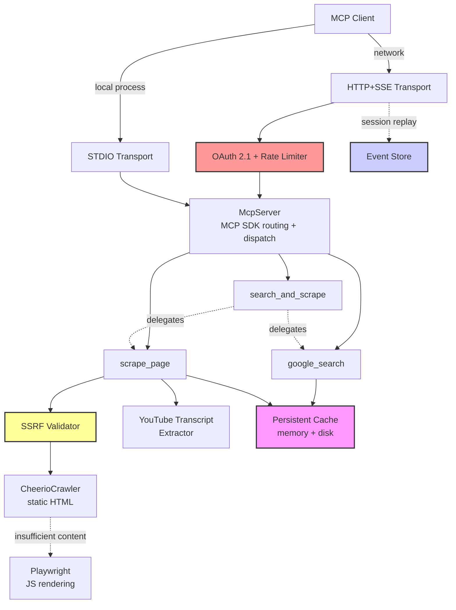

# Google Researcher MCP Server

[](https://github.com/zoharbabin/google-research-mcp/actions/workflows/ci.yml)
[](https://opensource.org/licenses/MIT)
[](https://nodejs.org/)
[](docs/CONTRIBUTING.md)

A [Model Context Protocol (MCP)](https://modelcontextprotocol.io/) server that gives AI assistants the ability to search Google, scrape web pages (including JavaScript-rendered sites), and extract YouTube transcripts. Built for performance, reliability, and security.

## Quick Start

### Zero-Install (npx)

The fastest way to start — no cloning required. Add this to your MCP client config:

**Claude Code** (`~/.claude/claude_desktop_config.json`), **Cline**, or **Roo Code** (MCP settings):
```json
{
  "mcpServers": {
    "google-researcher": {
      "command": "npx",
      "args": ["-y", "google-researcher-mcp"],
      "env": {
        "GOOGLE_CUSTOM_SEARCH_API_KEY": "your-key",
        "GOOGLE_CUSTOM_SEARCH_ID": "your-cx"
      }
    }
  }
}
```

Replace `your-key` and `your-cx` with your [Google Custom Search API Key](https://developers.google.com/custom-search/v1/introduction) and [Search Engine ID](https://programmablesearchengine.google.com/).

### Local Development

```bash
git clone https://github.com/zoharbabin/google-research-mcp.git && cd google-researcher-mcp
npm install && npx playwright install chromium
cp .env.example .env   # Then add your Google API keys to .env
npm run dev            # Server is now running on STDIO transport
```

> **Note:** This starts the server in STDIO mode, which is all you need for local AI assistant integrations. HTTP transport with OAuth is only required for web-based or multi-client setups — see [Choosing a Transport](#choosing-a-transport).

---

## Table of Contents

- [Available Tools](#available-tools)
- [Features](#features)
- [System Architecture](#system-architecture)
- [Getting Started](#getting-started)
  - [Prerequisites](#prerequisites)
  - [Installation & Setup](#installation--setup)
  - [Running the Server](#running-the-server)
  - [Running with Docker](#running-with-docker)
- [Usage](#usage)
  - [Choosing a Transport](#choosing-a-transport)
  - [Client Integration](#client-integration)
  - [Management API](#management-api)
- [Security](#security)
  - [OAuth 2.1 Authorization](#oauth-21-authorization)
  - [Available Scopes](#available-scopes)
- [Testing](#testing)
- [Troubleshooting](#troubleshooting)
- [Roadmap](#roadmap)
- [Contributing](#contributing)
- [License](#license)

## Available Tools

### When to Use Each Tool

| Tool | Best For | Use When... |
| :--- | :--- | :--- |
| **`search_and_scrape`** | **Research (recommended)** | You need to answer a question using web sources. This is the most efficient choice — it searches AND retrieves content in one call. |
| **`google_search`** | Finding URLs only | You only need a list of URLs (not their content), or you want to process pages yourself with custom logic. |
| **`scrape_page`** | Reading a specific URL | You already have a URL and need its content. Also use for YouTube transcripts and documents (PDF, DOCX, PPTX). |

### Tool Details

| Tool | Description |
| :--- | :--- |
| **`search_and_scrape`** | Searches Google and retrieves content from top results in one call. Returns combined, deduplicated text with source attribution. Handles JavaScript-rendered pages and fails gracefully if some sources are unavailable.<br><br>**Parameters:** `query` (string, 1-500 chars), `num_results` (1-10, default 3), `include_sources` (boolean, default true), `deduplicate` (boolean, default true). |
| **`google_search`** | Returns ranked URLs from Google Custom Search. Use advanced filters for precise results: `site_search` (limit to domain), `time_range` (day/week/month/year), `exact_terms`, `exclude_terms`, `language`, `country`. Results cached 30 min.<br><br>**Parameters:** `query` (string, 1-500 chars), `num_results` (1-10, default 5), plus optional filters. |
| **`scrape_page`** | Extracts text from a URL. Auto-detects content type: web pages (static or JS-rendered), YouTube videos (transcript), documents (PDF/DOCX/PPTX). Results cached 1 hour.<br><br>**Parameters:** `url` (string, max 2048 chars). |

## Features

- **Tiered Web Scraping**: Fast static HTML extraction (CheerioCrawler), with automatic Playwright/Chromium fallback for JavaScript-rendered pages. Zero configuration — Chromium is installed as part of setup.
- **YouTube Transcript Extraction**: Robust extraction with 10 classified error types, automatic retries with exponential backoff for transient failures, and clear actionable error messages. See the [full documentation](./docs/youtube-transcript-extraction.md).
- **Persistent Caching**: Two-layer cache (in-memory + disk) with per-tool namespaces. Reduces latency on repeated queries and minimizes Google API costs. Manual and automated persistence via the [Management API](#management-api).
- **Dual Transport**: STDIO for local MCP clients, HTTP+SSE for web applications and multi-client setups.
- **Enterprise Security**: OAuth 2.1 with JWT validation, granular scopes, and SSRF protection for scraping.
- **Graceful Degradation**: Comprehensive timeouts, resilient multi-source scraping (`Promise.allSettled`), and automatic error recovery.
- **Monitoring**: Administrative endpoints for cache stats, event store stats, and cache management.

## System Architecture



For a detailed explanation, see the [Architecture Guide](./docs/architecture/architecture.md).

## Getting Started

### Prerequisites

- **Node.js** 20.0.0 or higher
- **Google API Keys**:
  - [Custom Search API Key](https://developers.google.com/custom-search/v1/introduction)
  - [Custom Search Engine ID](https://programmablesearchengine.google.com/)
- **Chromium** (for JavaScript rendering): Installed automatically via `npx playwright install chromium`
- **OAuth 2.1 Provider** (HTTP transport only): An external authorization server (e.g., Auth0, Okta) to issue JWTs. Not needed for STDIO.

### Installation & Setup

1.  **Clone the Repository**:
    ```bash
    git clone https://github.com/zoharbabin/google-research-mcp.git
    cd google-researcher-mcp
    ```

2.  **Install Dependencies**:
    ```bash
    npm install
    npx playwright install chromium
    ```

3.  **Configure Environment Variables**:
    ```bash
    cp .env.example .env
    ```
    Open `.env` and add your Google API keys. All other variables are optional — see the comments in `.env.example` for detailed explanations.

### Running the Server

-   **Development** (auto-reload on file changes):
    ```bash
    npm run dev
    ```

-   **Production**:
    ```bash
    npm run build
    npm start
    ```

### Running with Docker

```bash
# Build the image
docker build -t google-researcher-mcp .

# Run in STDIO mode (default, for MCP clients)
docker run -i --rm --env-file .env google-researcher-mcp

# Run with HTTP transport on port 3000
# (MCP_TEST_MODE= overrides the Dockerfile default of "stdio" to enable HTTP)
docker run -d --rm --env-file .env -e MCP_TEST_MODE= -p 3000:3000 google-researcher-mcp
```

**Docker Compose** (quick HTTP transport setup):
```bash
cp .env.example .env   # Fill in your API keys
docker compose up --build
curl http://localhost:3000/health
```

**Docker with Claude Code** (`~/.claude/claude_desktop_config.json`):
```json
{
  "mcpServers": {
    "google-researcher": {
      "command": "docker",
      "args": ["run", "-i", "--rm", "--env-file", "/path/to/.env", "google-researcher-mcp"]
    }
  }
}
```

**Security note:** Never bake secrets into the Docker image. Always pass them at runtime via `--env-file` or `-e` flags.

## Usage

### Choosing a Transport

| | STDIO | HTTP+SSE |
|---|---|---|
| **Best for** | Local MCP clients (Claude Code, Cline, Roo Code) | Web apps, multi-client setups, remote access |
| **Auth** | None needed (process-level isolation) | OAuth 2.1 Bearer tokens required |
| **Setup** | Zero config — just provide API keys | Requires OAuth provider (Auth0, Okta, etc.) |
| **Scaling** | One server per client process | Single server, many concurrent clients |

**Recommendation**: Use **STDIO** for local AI assistant integrations. Use **HTTP+SSE** only when you need a shared service or web application integration.

### Client Integration

#### STDIO Client (Local Process)

```javascript
import { Client } from "@modelcontextprotocol/sdk/client/index.js";
import { StdioClientTransport } from "@modelcontextprotocol/sdk/client/stdio.js";

const transport = new StdioClientTransport({
  command: "node",
  args: ["dist/server.js"]
});
const client = new Client({ name: "my-client" });
await client.connect(transport);

// Search Google
const searchResult = await client.callTool({
  name: "google_search",
  arguments: { query: "Model Context Protocol" }
});
console.log(searchResult.content[0].text);

// Extract a YouTube transcript
const transcript = await client.callTool({
  name: "scrape_page",
  arguments: { url: "https://www.youtube.com/watch?v=dQw4w9WgXcQ" }
});
console.log(transcript.content[0].text);
```

#### HTTP+SSE Client (Web Application)

Requires a valid OAuth 2.1 Bearer token from your configured authorization server.

```javascript
import { Client } from "@modelcontextprotocol/sdk/client/index.js";
import { StreamableHTTPClientTransport } from "@modelcontextprotocol/sdk/client/streamableHttp.js";

const transport = new StreamableHTTPClientTransport(
  new URL("http://localhost:3000/mcp"),
  {
    getAuthorization: async () => `Bearer YOUR_ACCESS_TOKEN`
  }
);
const client = new Client({ name: "my-client" });
await client.connect(transport);

const result = await client.callTool({
  name: "search_and_scrape",
  arguments: { query: "Model Context Protocol", num_results: 3 }
});
console.log(result.content[0].text);
```

### Management API

Administrative and monitoring endpoints (HTTP transport only):

| Method | Endpoint | Description | Auth |
|--------|----------|-------------|------|
| `GET` | `/health` | Server health check (status, version, uptime) | Public |
| `GET` | `/version` | Server version and runtime info | Public |
| `GET` | `/mcp/cache-stats` | Cache performance statistics | `mcp:admin:cache:read` |
| `GET` | `/mcp/event-store-stats` | Event store usage statistics | `mcp:admin:event-store:read` |
| `POST` | `/mcp/cache-invalidate` | Clear specific cache entries | `mcp:admin:cache:invalidate` |
| `POST` | `/mcp/cache-persist` | Force cache save to disk | `mcp:admin:cache:persist` |
| `GET` | `/mcp/oauth-config` | Current OAuth configuration | `mcp:admin:config:read` |
| `GET` | `/mcp/oauth-scopes` | OAuth scopes documentation | Public |
| `GET` | `/mcp/oauth-token-info` | Token details | Authenticated |

## Security

### OAuth 2.1 Authorization

All HTTP endpoints under `/mcp/` (except public documentation) are protected by OAuth 2.1:

- **Token Validation**: JWTs are validated against your authorization server's JWKS endpoint (`${OAUTH_ISSUER_URL}/.well-known/jwks.json`).
- **Scope Enforcement**: Each tool and admin action requires a specific OAuth scope.

Configure `OAUTH_ISSUER_URL` and `OAUTH_AUDIENCE` in `.env`. See `.env.example` for details.

> **STDIO users**: OAuth is not used for STDIO transport. You can skip all OAuth configuration.

### Available Scopes

**Tool Execution:**
- `mcp:tool:google_search:execute`
- `mcp:tool:scrape_page:execute`
- `mcp:tool:search_and_scrape:execute`

**Administration:**
- `mcp:admin:cache:read`
- `mcp:admin:cache:invalidate`
- `mcp:admin:cache:persist`
- `mcp:admin:event-store:read`
- `mcp:admin:config:read`

## Testing

| Script | Description |
|--------|-------------|
| `npm test` | Run all unit/component tests (Jest) |
| `npm run test:e2e` | Full end-to-end suite (STDIO + HTTP + YouTube) |
| `npm run test:coverage` | Generate code coverage report |
| `npm run test:e2e:stdio` | STDIO transport E2E only |
| `npm run test:e2e:sse` | HTTP transport E2E only |
| `npm run test:e2e:youtube` | YouTube transcript E2E only |

**All NPM scripts:**

| Script | Description |
|--------|-------------|
| `npm start` | Run the built server (production) |
| `npm run dev` | Start with live-reload (development) |
| `npm run build` | Compile TypeScript to `dist/` |

For testing philosophy and structure, see the [Testing Guide](./docs/testing-guide.md).

## Troubleshooting

- **Server won't start**: Ensure `GOOGLE_CUSTOM_SEARCH_API_KEY` and `GOOGLE_CUSTOM_SEARCH_ID` are set in `.env`. The server exits with a clear error if either is missing.
- **Empty scrape results**: The persistent cache may contain stale entries. Delete `storage/persistent_cache/namespaces/scrapePage/` and restart to force fresh scrapes.
- **Playwright/Chromium errors**: Re-run `npx playwright install chromium`. On Linux, also run `npx playwright install-deps chromium` for system dependencies. In Docker, these are pre-installed.
- **Port 3000 in use**: Stop the other process (`lsof -ti:3000 | xargs kill`) or set `PORT=3001 npm start`.
- **YouTube transcripts fail**: Some videos have transcripts disabled by the owner. The error message includes the specific reason (e.g., `TRANSCRIPT_DISABLED`, `VIDEO_UNAVAILABLE`). See the [YouTube Transcript Documentation](./docs/youtube-transcript-extraction.md) for all error codes.
- **Cache issues**: Use `/mcp/cache-stats` to inspect cache health, or `/mcp/cache-persist` to force a save. See the [Management API](#management-api).
- **OAuth errors**: Verify `OAUTH_ISSUER_URL` and `OAUTH_AUDIENCE` in `.env`. Use `/mcp/oauth-config` to inspect current configuration.
- **Docker health check failing**: The health check hits `/health` on port 3000, which requires HTTP transport. In STDIO mode (`MCP_TEST_MODE=stdio`), the health check will fail — this is expected.

## Roadmap

Feature requests and improvements are tracked as [GitHub Issues](https://github.com/zoharbabin/google-research-mcp/issues). Contributions welcome.

## Contributing

We welcome contributions of all kinds! Please see the [Contribution Guidelines](./docs/CONTRIBUTING.md) for details.

## License

This project is licensed under the MIT License. See the [LICENSE](./LICENSE) file for details.
