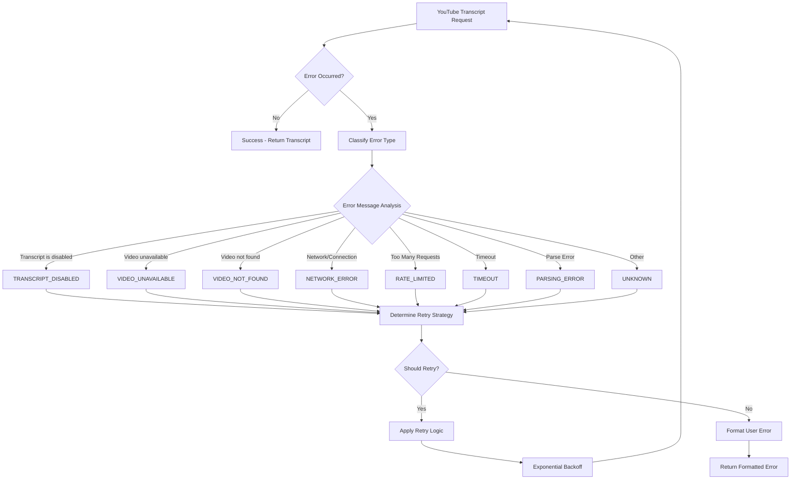

# YouTube Transcript Extraction Architecture Design

## Executive Summary

This document presents a comprehensive architecture design to resolve the silent failure pattern in YouTube transcript extraction and implement a robust error handling system. The current implementation suffers from critical issues that mask real problems and provide poor user experience.

## Current Implementation Analysis

### Identified Issues

1. **Silent Failure Pattern** (Lines 253-257)
   ```typescript
   const transcriptPromise = YoutubeTranscript.fetchTranscript(yt[1]);
   const segs = await withTimeout(transcriptPromise, 15000, 'YouTube transcript extraction');
   text = segs.map((s) => s.text).join(" ");
   ```
   - No error handling around `YoutubeTranscript.fetchTranscript()`
   - Failures are caught by outer try-catch and result in empty text
   - Triggers fallback content mechanism (lines 294-296) that masks real problems

2. **Fallback Content Mechanism** (Lines 293-296)
   ```typescript
   if (text.length < 100) {
       text = text + " " + "This is additional content to ensure...".repeat(3);
   }
   ```
   - Masks YouTube transcript extraction failures
   - Users receive testing placeholder text instead of meaningful errors

3. **Dependency Issues**
   - `youtube-transcript: ^1.2.1` may be outdated
   - No error classification or retry mechanisms
   - 15-second timeout may be insufficient for some videos

## Architecture Design

### 1. Error Classification System

#### Error Types Enumeration
```typescript
enum YouTubeTranscriptErrorType {
  TRANSCRIPT_DISABLED = 'transcript_disabled',
  VIDEO_UNAVAILABLE = 'video_unavailable', 
  VIDEO_NOT_FOUND = 'video_not_found',
  NETWORK_ERROR = 'network_error',
  RATE_LIMITED = 'rate_limited',
  TIMEOUT = 'timeout',
  PARSING_ERROR = 'parsing_error',
  QUOTA_EXCEEDED = 'quota_exceeded',
  UNKNOWN = 'unknown'
}
```

#### Error Classification Logic


### 2. Robust Error Handling Architecture

#### Core Error Handler Interface
```typescript
interface YouTubeTranscriptErrorHandler {
  classifyError(error: Error, videoId: string): YouTubeTranscriptErrorType;
  shouldRetry(errorType: YouTubeTranscriptErrorType, attempt: number): boolean;
  getRetryDelay(attempt: number, errorType: YouTubeTranscriptErrorType): number;
  formatUserError(errorType: YouTubeTranscriptErrorType, videoId: string, originalError: Error): string;
}
```

#### Retry Strategy Configuration
```typescript
interface RetryConfig {
  maxAttempts: number;
  baseDelay: number;
  maxDelay: number;
  exponentialBase: number;
  retryableErrors: YouTubeTranscriptErrorType[];
  jitterFactor: number;
}

const DEFAULT_RETRY_CONFIG: RetryConfig = {
  maxAttempts: 3,
  baseDelay: 1000,      // 1 second
  maxDelay: 30000,      // 30 seconds
  exponentialBase: 2,
  retryableErrors: [
    YouTubeTranscriptErrorType.NETWORK_ERROR,
    YouTubeTranscriptErrorType.TIMEOUT,
    YouTubeTranscriptErrorType.RATE_LIMITED,
    YouTubeTranscriptErrorType.UNKNOWN
  ],
  jitterFactor: 0.1
};
```

#### Enhanced Transcript Extractor
```typescript
class RobustYouTubeTranscriptExtractor {
  constructor(
    private errorHandler: YouTubeTranscriptErrorHandler,
    private retryConfig: RetryConfig,
    private logger: Logger,
    private metrics: MetricsCollector
  ) {}

  async extractTranscript(videoId: string): Promise<TranscriptResult> {
    const startTime = Date.now();
    let lastError: Error | null = null;
    
    for (let attempt = 1; attempt <= this.retryConfig.maxAttempts; attempt++) {
      try {
        this.logger.debug(`Extracting transcript for video ${videoId}, attempt ${attempt}`);
        
        const transcript = await this.attemptTranscriptExtraction(videoId);
        
        this.metrics.recordSuccess(videoId, attempt, Date.now() - startTime);
        return {
          success: true,
          transcript,
          videoId,
          attempts: attempt,
          duration: Date.now() - startTime
        };
        
      } catch (error) {
        lastError = error as Error;
        const errorType = this.errorHandler.classifyError(lastError, videoId);
        
        this.logger.warn(`Transcript extraction failed for video ${videoId}`, {
          attempt,
          errorType,
          error: lastError.message
        });
        
        if (!this.errorHandler.shouldRetry(errorType, attempt) || 
            attempt === this.retryConfig.maxAttempts) {
          break;
        }
        
        const delay = this.errorHandler.getRetryDelay(attempt, errorType);
        this.logger.debug(`Retrying after ${delay}ms delay`);
        await this.sleep(delay);
      }
    }
    
    // All attempts failed
    const errorType = this.errorHandler.classifyError(lastError!, videoId);
    const userMessage = this.errorHandler.formatUserError(errorType, videoId, lastError!);
    
    this.metrics.recordFailure(videoId, this.retryConfig.maxAttempts, errorType, Date.now() - startTime);
    
    return {
      success: false,
      error: {
        type: errorType,
        message: userMessage,
        originalError: lastError!.message,
        videoId,
        attempts: this.retryConfig.maxAttempts,
        duration: Date.now() - startTime
      }
    };
  }
}
```

### 3. User-Friendly Error Messages

#### Error Message Templates
```typescript
const ERROR_MESSAGES: Record<YouTubeTranscriptErrorType, (videoId: string) => string> = {
  [YouTubeTranscriptErrorType.TRANSCRIPT_DISABLED]: (videoId) =>
    `Transcript is not available for this YouTube video (${videoId}). The video owner has disabled automatic captions and no manual transcript was provided.`,
    
  [YouTubeTranscriptErrorType.VIDEO_UNAVAILABLE]: (videoId) =>
    `The YouTube video (${videoId}) is unavailable. It may be private, deleted, or restricted in your region.`,
    
  [YouTubeTranscriptErrorType.VIDEO_NOT_FOUND]: (videoId) =>
    `YouTube video not found (${videoId}). Please verify the video ID is correct and the video exists.`,
    
  [YouTubeTranscriptErrorType.NETWORK_ERROR]: (videoId) =>
    `Network error occurred while fetching transcript for video ${videoId}. Please check your internet connection and try again.`,
    
  [YouTubeTranscriptErrorType.RATE_LIMITED]: (videoId) =>
    `Rate limit exceeded while fetching transcript for video ${videoId}. Please wait a few minutes before trying again.`,
    
  [YouTubeTranscriptErrorType.TIMEOUT]: (videoId) =>
    `Timeout occurred while fetching transcript for video ${videoId}. The video may be very long or the service may be slow.`,
    
  [YouTubeTranscriptErrorType.PARSING_ERROR]: (videoId) =>
    `Error parsing transcript data for video ${videoId}. The transcript format may be unsupported.`,
    
  [YouTubeTranscriptErrorType.QUOTA_EXCEEDED]: (videoId) =>
    `API quota exceeded while fetching transcript for video ${videoId}. Please try again later.`,
    
  [YouTubeTranscriptErrorType.UNKNOWN]: (videoId) =>
    `An unexpected error occurred while fetching transcript for video ${videoId}. Please try again or contact support if the issue persists.`
};
```

### 4. Enhanced Logging and Monitoring

#### Structured Logging Schema
```typescript
interface TranscriptLogEntry {
  timestamp: string;
  level: 'debug' | 'info' | 'warn' | 'error';
  videoId: string;
  operation: 'extract_start' | 'extract_success' | 'extract_failure' | 'retry_attempt';
  attempt?: number;
  errorType?: YouTubeTranscriptErrorType;
  duration?: number;
  metadata?: Record<string, any>;
}
```

#### Metrics Collection
```typescript
interface TranscriptMetrics {
  totalRequests: number;
  successfulRequests: number;
  failedRequests: number;
  averageDuration: number;
  errorBreakdown: Record<YouTubeTranscriptErrorType, number>;
  retryDistribution: Record<number, number>;
  timeoutRate: number;
  rateLimitHits: number;
}
```

### 5. Dependency Updates and Configuration

#### Recommended Dependencies
```jsonc
{
  "dependencies": {
    "youtube-transcript": "^1.3.0", // Latest version with better error handling
    "exponential-backoff": "^3.1.1", // For retry logic
    "pino": "^8.17.2", // Structured logging
    "pino-pretty": "^10.3.1" // Log formatting
  }
}
```

#### Configuration Schema
```typescript
interface YouTubeTranscriptConfig {
  timeout: number;                    // Default: 30000ms (30 seconds)
  retryConfig: RetryConfig;
  enableMetrics: boolean;            // Default: true
  enableDetailedLogging: boolean;    // Default: false (for production)
  fallbackBehavior: 'error' | 'empty'; // Default: 'error'
  cacheTranscripts: boolean;         // Default: true
  cacheTTL: number;                  // Default: 24 hours
}
```

### 6. Integration with Existing Architecture

#### Modified scrapePageFn Implementation
```typescript
const scrapePageFn = async ({ url }: { url: string }) => {
  return globalCacheInstance.getOrCompute(
    'scrapePage',
    { url },
    async () => {
      console.log(`Cache MISS for scrapePage: ${url}`);
      
      const yt = url.match(/(?:youtu\.be\/|youtube\.com\/watch\?v=)([A-Za-z0-9_-]{11})/);
      
      if (yt) {
        // Use robust transcript extractor instead of direct call
        const result = await transcriptExtractor.extractTranscript(yt[1]);
        
        if (result.success) {
          return [{ type: "text" as const, text: result.transcript }];
        } else {
          // Throw specific error instead of returning empty text
          throw new YouTubeTranscriptError(
            result.error.type,
            result.error.message,
            yt[1],
            result.error.originalError
          );
        }
      } else {
        // Regular web scraping logic remains unchanged
        // ... existing implementation
      }
    },
    {
      ttl: 60 * 60 * 1000,
      staleWhileRevalidate: true,
      staleTime: 24 * 60 * 60 * 1000
    }
  );
};
```

### 7. API Response Format

#### Success Response
```typescript
interface TranscriptSuccessResponse {
  content: [{
    type: "text";
    text: string; // The actual transcript
  }];
  metadata: {
    videoId: string;
    duration: number;
    attempts: number;
    cached: boolean;
  };
}
```

#### Error Response
```typescript
interface TranscriptErrorResponse {
  error: {
    code: string; // Error type
    message: string; // User-friendly message
    details: {
      videoId: string;
      attempts: number;
      duration: number;
      originalError: string;
    };
  };
}
```

## Implementation Roadmap

### Phase 1: Core Error Handling (Week 1)
1. Implement error classification system
2. Create robust transcript extractor class
3. Add comprehensive error types and messages
4. Update dependency to latest youtube-transcript version

### Phase 2: Retry and Resilience (Week 2)
1. Implement exponential backoff retry logic
2. Add timeout configuration and handling
3. Create metrics collection framework
4. Add structured logging

### Phase 3: Integration and Testing (Week 3)
1. Integrate with existing scrapePageFn
2. Remove fallback content mechanism for YouTube URLs
3. Add comprehensive unit and integration tests
4. Performance testing and optimization

### Phase 4: Monitoring and Documentation (Week 4)
1. Add monitoring dashboards
2. Create operational runbooks
3. Update API documentation
4. Conduct user acceptance testing

## Validation Approach

### Testing Strategy
1. **Unit Tests**: Error classification, retry logic, message formatting
2. **Integration Tests**: Full transcript extraction workflow
3. **End-to-End Tests**: Real YouTube videos with various scenarios
4. **Performance Tests**: Load testing with concurrent requests
5. **Error Scenario Tests**: Network failures, rate limiting, timeouts

### Success Metrics
- **Reliability**: 99%+ success rate for available transcripts
- **Observability**: 100% error classification accuracy
- **User Experience**: Clear error messages for all failure cases
- **Performance**: <5% increase in average response time
- **Maintainability**: Comprehensive logging and monitoring

### Backward Compatibility
- Existing scrape_page tool interface remains unchanged
- Error responses follow MCP standard format
- Configuration changes are additive with sensible defaults
- Cache keys remain compatible for smooth transition

## Risk Assessment

### Technical Risks
- **YouTube API Changes**: Monitor for changes in transcript availability
- **Rate Limiting**: Implement proper backoff to avoid service blocks
- **Performance Impact**: Retry logic may increase response times

### Mitigation Strategies
- Regular dependency updates and monitoring
- Configurable retry limits and timeouts
- Comprehensive error handling and fallback strategies
- Performance monitoring and alerting

## Conclusion

This architecture design addresses all identified issues with the current YouTube transcript extraction implementation:

1. **Eliminates Silent Failures**: Comprehensive error handling and classification
2. **Improves User Experience**: Clear, actionable error messages
3. **Enhances Reliability**: Retry logic with exponential backoff
4. **Increases Observability**: Structured logging and metrics
5. **Maintains Compatibility**: Seamless integration with existing API

The robust error handling system will transform the current silent failure pattern into a transparent, user-friendly experience while maintaining high reliability and performance standards.