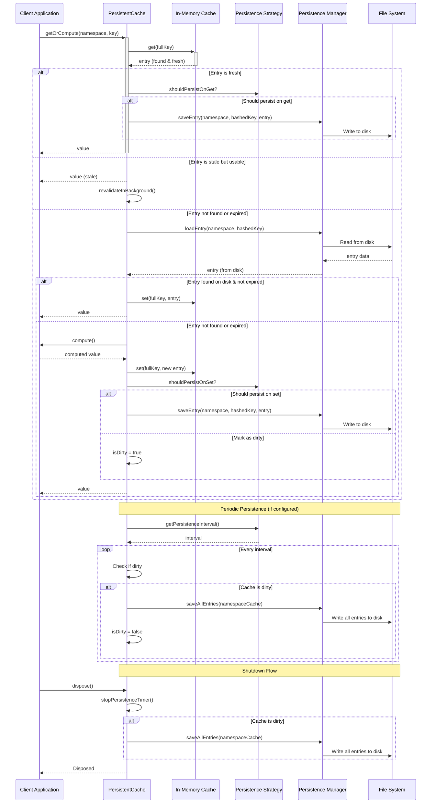

```mermaid
sequenceDiagram
    participant Client as Client Application
    participant PCache as PersistentCache
    participant InMem as In-Memory Cache
    participant PStrat as Persistence Strategy
    participant PMgr as Persistence Manager
    participant FS as File System

    %% Cache Hit Flow
    Client->>+PCache: getOrCompute(namespace, key)
    PCache->>+InMem: get(fullKey)
    InMem-->>-PCache: entry (found & fresh)
    
    alt Entry is fresh
        PCache->>PStrat: shouldPersistOnGet?
        
        alt Should persist on get
            PCache->>PMgr: saveEntry(namespace, hashedKey, entry)
            PMgr->>FS: Write to disk
        end
        
        PCache-->>-Client: value
        
    else Entry is stale but usable
        PCache-->>Client: value (stale)
        PCache->>PCache: revalidateInBackground()
        
    else Entry not found or expired
        PCache->>PMgr: loadEntry(namespace, hashedKey)
        PMgr->>FS: Read from disk
        FS-->>PMgr: entry data
        PMgr-->>PCache: entry (from disk)
        
        alt Entry found on disk & not expired
            PCache->>InMem: set(fullKey, entry)
            PCache-->>Client: value
            
        else Entry not found or expired
            PCache->>Client: compute()
            Client-->>PCache: computed value
            PCache->>InMem: set(fullKey, new entry)
            PCache->>PStrat: shouldPersistOnSet?
            
            alt Should persist on set
                PCache->>PMgr: saveEntry(namespace, hashedKey, entry)
                PMgr->>FS: Write to disk
            else Mark as dirty
                PCache->>PCache: isDirty = true
            end
            
            PCache-->>Client: value
        end
    end

    %% Periodic Persistence
    Note over PCache,FS: Periodic Persistence (if configured)
    PCache->>PStrat: getPersistenceInterval()
    PStrat-->>PCache: interval
    
    loop Every interval
        PCache->>PCache: Check if dirty
        
        alt Cache is dirty
            PCache->>PMgr: saveAllEntries(namespaceCache)
            PMgr->>FS: Write all entries to disk
            PCache->>PCache: isDirty = false
        end
    end

    %% Shutdown Flow
    Note over PCache,FS: Shutdown Flow
    Client->>PCache: dispose()
    PCache->>PCache: stopPersistenceTimer()
    
    alt Cache is dirty
        PCache->>PMgr: saveAllEntries(namespaceCache)
        PMgr->>FS: Write all entries to disk
    end
    
    PCache-->>Client: Disposed
```